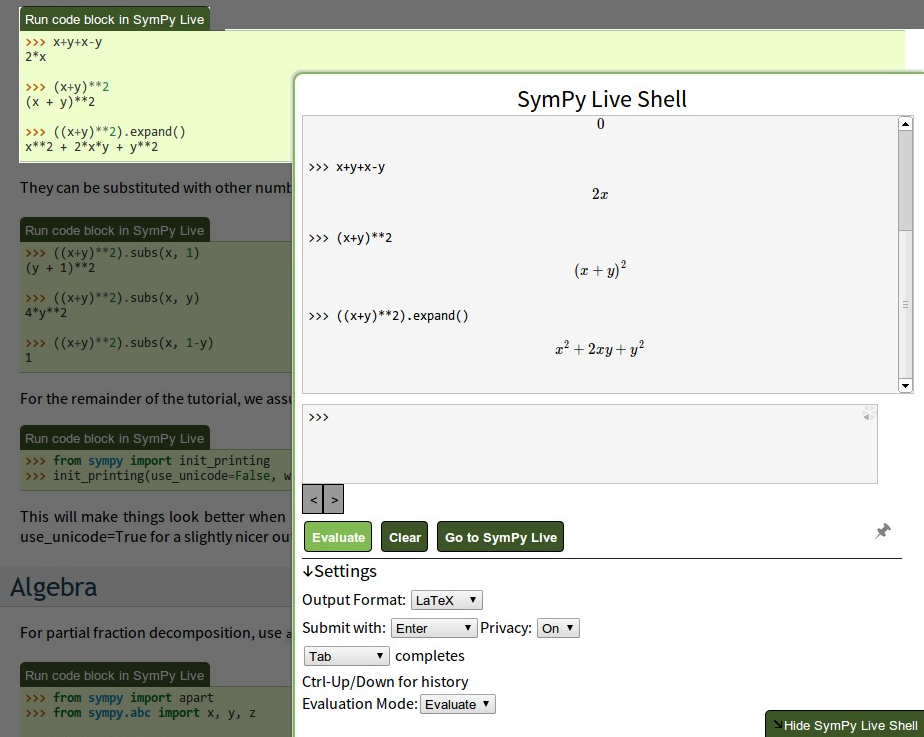
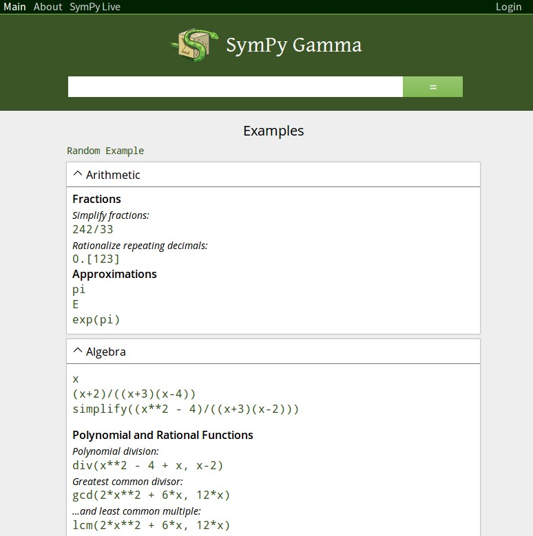
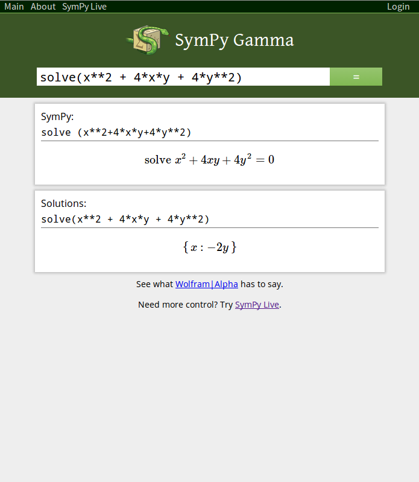

%  SymPy Gamma and SymPy Live: Python and Mathematics Online
% David Li
% 27 June 2013

# Background

- High school student!
- Google Code-In 2011 – SymPy Live
    - Mobile site
    - Autocompletion

- 2012…
    - Resurrected Gamma
    - Misc. improvements for Live

# SymPy Live

http://live.sympy.org

What's this? Try it out!

    >>> (1/cos(x)).series(x, 0, 10)
    >>> integrate(x**2 * sin(x))

__http://goo.gl/ijLD4__

<!-- TODO: seems to hang Live site when visited from mobile -->

---

## Uses

- Interactive documentation
    - Play with SymPy with the docs in front of you
- "Try-before-you-buy" (though SymPy is free)
    - Explore nearly all of SymPy's features online
    - http://docs.sympy.org/0.7.2/tutorial.html

<!--

What I could say, using SymPy tutorial/talk as an example

- What if the user wants to play with these examples?

1. Copy-and-paste into a terminal. This is annoying. She would have to
   delete all the >>> blocks manually, get rid of example output, etc...

   We could improve this by adding a button to do this for her, or...
2. Leverage SymPy Live. Click a button, and the terminal appears in the
   browser.

-->

- Other projects can benefit too!
    - Sphinx extension

---

---

## Implementation

- Python 2.7 on Google App Engine
- Complications
    - No persistent interpreter
    - Can't pickle everything
    - Execution time limit

---

## How we handle it

#. Reinitialize globals
    - Reevaluate any statement that created an unpickable
    - Unpickle everything else
#. Evaluate the statement(s)
#. Look at the new globals
    - If any are unpicklable, store the statement itself
    - Else just pickle and store the globals

(There are some other complications relating to `exec`-vs-`eval` and so on)

---

- Problems
    - What if (an expression involving) `_` created an unpicklable?

        (I'm not sure, either.)

- Improvements?
    - Retain shell session when navigating between pages

# SymPy Gamma

http://www.sympygamma.com

---

## Features

- Enter an expression, get information about it

---

- Integrals: get steps, solution
- Trigonometric expression: alternate forms
- Most expressions: 2D graph
- Numerical expressions: floating-point approximations
- Function: documentation
- Purpose
    - Showcase what SymPy can do
    - Because Wolfram has it

---

## Implementation

#. Determine which "cards" to use based on the type of the input
#. Return these (with some HTML scaffolding) to the browser
#. Browser loads the result from the server via JavaScript

---

- Quite simple
- Most interesting features implemented in JavaScript:
    - 2D plotting with SVG

---

## ToDos

- Some way to unit test
- More result types!
