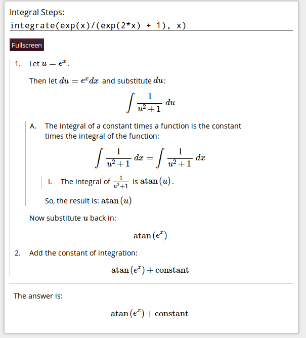
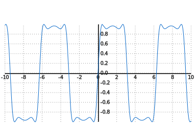

%  SymPy Gamma and SymPy Live: Python and Mathematics Online
% David Li
% 27 June 2013

# Background

- High school student!
- Google Code-In 2011 – SymPy Live
    - Mobile site
    - Autocompletion

- 2012…
    - Resurrected Gamma
    - Misc. improvements for Live

- Contributing experiences

# SymPy Live

http://live.sympy.org

What's this? Try it out!

    >>> (1/cos(x)).series(x, 0, 10)
    >>> integrate(x**2 * sin(x))

__http://goo.gl/ijLD4__

<!-- TODO: seems to hang Live site when visited from mobile -->

---

## Uses

- Interactive documentation
    - Play with SymPy with the docs in front of you
- "Try-before-you-buy" (though SymPy is free)
    - Explore nearly all of SymPy's features online
    - http://docs.sympy.org/0.7.2/tutorial.html

- Other projects can benefit too!
    - Sphinx extension

---

---

## Case Study: Sphinx Extension

- Built on a SciPy 2011 presentation!
- Sphinx extension adds script/link tags to docs
- Live server provides these resources

---

## Implementation

- Python 2.7 on Google App Engine
- Complications
    - No persistent interpreter
    - Can't pickle everything
    - Execution time limit

---

## How we handle it

#. Reinitialize globals
    - Reevaluate any statement that created an unpickable
    - Unpickle everything else
#. Evaluate the statement(s)
#. Look at the new globals
    - If any are unpicklable, store the statement itself
    - Else just pickle and store the globals

---

- Problems
    - What if (an expression involving) `_` created an unpicklable?
    - Function definitions
- Improvements?
    - Retain session when navigating between pages (Sphinx)
    - Fixing bugs!

# SymPy Gamma

http://www.sympygamma.com

---

## Features

- Enter an expression, get information about it

---

- Integrals: get steps, solution

---

- Trigonometric expression: alternate forms

---

- Most expressions: 2D graph. Here: $$ sin(2 sin(2 sin(x))) $$

Can export to SVG, used here; no link provided (it's rather slow).

---

- Numerical expressions: floating-point approximations

---

<!--

Demonstrate:

- Various result types
    - (put inputs here)
- Graphing (zoom, pan, export, resize)

-->

---

## Implementation

#. Determine which "cards" to use based on the type of the input
#. Return these (with some HTML scaffolding) to the browser
#. Browser loads the result from the server via JavaScript

---

- Quite simple
- Interesting features implemented in JavaScript:
    - 2D plotting with SVG
